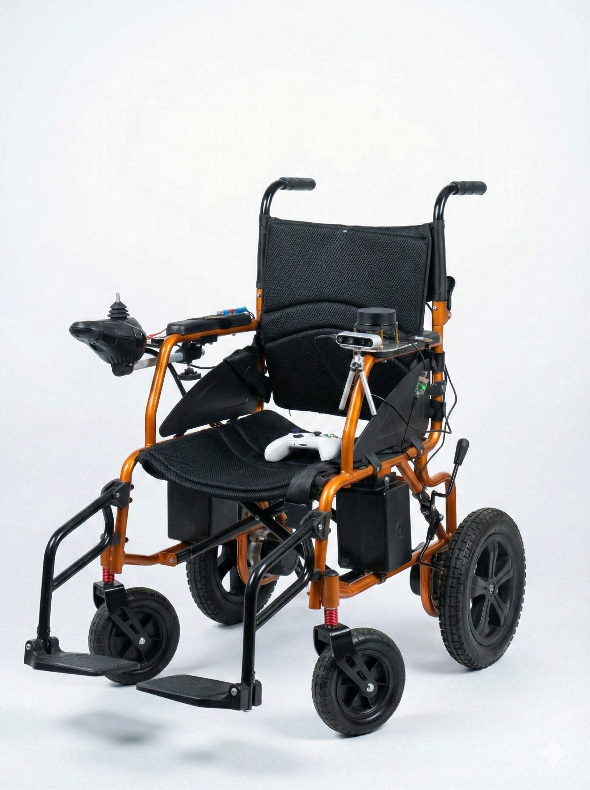

# Wheebot - Autonomous (Robotic) Wheelchair

<!-- WHEEBOT PHOTO -->
<br />
<p align="center">
   
</p>

## Table of Contents

* [About](#about)
* [Getting Started](#getting-started)
* [Usage](#usage)
* [License](#license)
* [Acknowledgements](#acknowledgements)

<!-- ABOUT -->
## About

This repository contains the source code, implementation, and evaluation resources for the undergraduate thesis titled **"Mapping System to Support Autonomous Wheelchair Navigation Based on RTAB-Map and Dynamic Object Removal."**

Have you ever encountered "ghosting" artifacts in your SLAM maps caused by moving people in the environment?
Do you want to understand how to integrate Deep Learning-based segmentation with Visual SLAM to create a clean, static map in a crowded indoor setting?

This project addresses exactly that. It focuses on enhancing point-to-point navigation for autonomous wheelchairs by solving the problem of dynamic objects (like pedestrians) in complex environments. By implementing a **Dynamic Object Removal (DOR)** module as a preprocessing layer, we ensure that the SLAM algorithm receives only "clean" static data, significantly improving localization stability and loop closure effectiveness.

**Key Topics and Technologies:**
* **Visual SLAM:** Robust mapping using [RTAB-Map](https://github.com/introlab/rtabmap) (Real-Time Appearance-Based Mapping).
* **Dynamic Object Removal (DOR):** Real-time filtering of moving objects to prevent map contamination.
* **Instance Segmentation:** Leveraging [YOLOv8](https://github.com/ultralytics/ultralytics) for precise object detection and segmentation.
* **Image Inpainting:** Filling in removed dynamic areas to maintain visual consistency.
* **ROS 2 Navigation:** Seamless integration with the Robot Operating System ecosystem.

**Performance Highlights:**
Our proposed method has been rigorously tested to validate its effectiveness in real-world scenarios:
* **Mapping Quality:** Achieved a Structural Similarity Index Measure (**SSIM**) of **0.81**.
* **Localization Accuracy:** Maintained high precision with an Absolute Trajectory Error (**ATE**) of just **2.63 cm**.
* **Robustness:** Successfully reduced dynamic artifacts with a Residual Dynamic Ratio (**RDR**) of **0.21**.
* **Navigation:** Delivered a reliable navigation success rate of **90%**.

<!-- GETTING STARTED -->
## Getting Started
You can validate this system using the recorded rosbags (if you have) or deploy it directly onto the Autonomous Wheelchair hardware. The core Dynamic Object Removal (DOR) and mapping algorithms are designed to be hardware-agnostic, provided you have an RGB-D input stream.

### Prerequisites
You don't need deep expertise in SLAM mathematics to use this package, but a basic understanding of **ROS 2** concepts (Nodes, Topics, TF2) is recommended.
Since this system integrates Deep Learning with Robotics, proficiency in **Python** (for the DOR module/YOLO) and basic **C++** (for hardware interfacing) is required.

To prepare your workstation (or the Robot's PC), you need:
* **Operating System:** Install Ubuntu 24.04 LTS.
    Download the ISO [Ubuntu 24.04](https://ubuntu.com/download/desktop) for your PC (Intel NUC recommended for the robot).
* **ROS 2:** Install [ROS Jazzy Jalisco](https://docs.ros.org/en/jazzy/Installation/Ubuntu-Install-Debians.html) on your Ubuntu 24.04.
* **Dependencies:** Install the necessary ROS 2 libraries for [librealsense](https://github.com/realsenseai/librealsense/blob/master/doc/installation.md), Navigation, Vision, and SLAM.

Run the following command to install the system dependencies:
```sh
sudo apt-get update && sudo apt-get install -y \
     ros-jazzy-ros2-controllers \
     ros-jazzy-gz* \
     ros-jazzy-ros-gz* \
     ros-jazzy-ros2-control* \
     ros-jazzy-joint-state-publisher-gui \
     ros-jazzy-joy \
     ros-jazzy-joy-teleop \
     ros-jazzy-nav2* \
     ros-jazzy-tf-transformations \
     ros-jazzy-rtabmap* \
     ros-jazzy-twist-mux* \
     python3-pip
```
Then, run the following command to install Ultralytics library:
```sh
pip3 install torch ultralytics
```

<!-- USAGE -->
## Usage
To Launch the Simulation of the Robot 
1. Clone the repo
```sh
git clone https://github.com/therafaeliger/wheebot_ws.git
```
2. Build the ROS 2 workspace
```sh
cd ~/wheebot_ws/
```
```sh
colcon build
```
3. Source the ROS 2 Workspace
```sh
. install/setup.bash
```
4. Launch the Gazebo simulation
```sh
ros2 launch wheebot_bringup simulation.launch.py
```
To Launch the Robot (Hardware)
1. **Hardware Setup:** Before launching, make sure all peripherals are correctly connected to the Main PC (Intel NUC):
* **Camera:** Connect the Intel RealSense D435i via a **USB 3.0** port (Critical for RGB-D bandwidth).
* **Microcontroller:** Connect the Arduino Nano via USB for motor control.
* **Power:** Ensure the wheelchair batteries are charged and the motor drivers are powered on.
2. Build the ROS 2 workspace
```sh
cd ~/wheebot_ws/
```
```sh
colcon build
```
3. Source the ROS 2 Workspace
```sh
. install/setup.bash
```
4. Launch the Physical Robot
This will start the RealSense driver, DOR node, RTAB-Map, and Hardware Interface.
```sh
ros2 launch wheebot_bringup robot.launch.py

```

<!-- LICENSE -->
## License

Distributed under the Apache 2.0 License. See `LICENSE` for more information.

<!-- ACKNOWLEDGEMENTS -->
## Acknowledgements

I would like to express my gratitude to the following institutions and communities for their support, resources, and guidance throughout the development of this research:

* **Embedded Systems and Robotics Laboratory**
* **Elins Research Club**
* **Electronics and Instrumentation Study Program**
* **Department of Computer Science and Electronics Faculty of Mathematics and Natural Sciences, Universitas Gadjah Mada**
